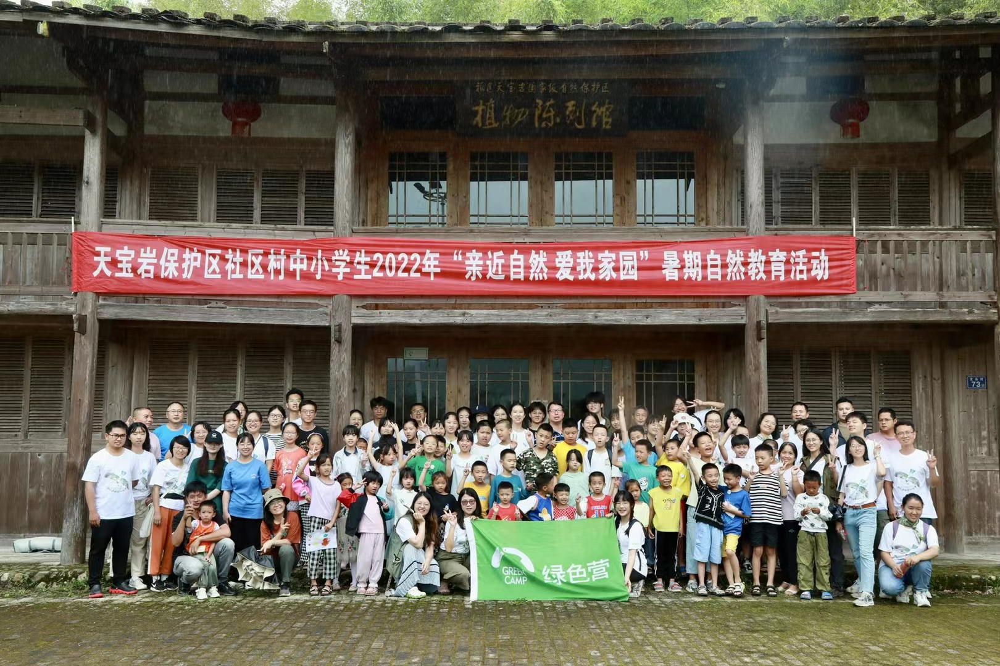

```{r setup, include=FALSE}
knitr::opts_chunk$set(echo = TRUE)
```

## {.tabset}

### Articles

**Green Camp**

{width=10%}

[Day 1](https://mp.weixin.qq.com/s/DrvQ7vL74wHQdw_S0dhzgw)

[Day 2-3](https://mp.weixin.qq.com/s/IIt6jdHti-dT-KT8U3vLRw)

[Day 4-5](https://mp.weixin.qq.com/s/2qOcG9_jjVGU6iaNZ_l8MA)

### Pictures

### Vedios

**[Kingfisher](https://www.bilibili.com/video/BV1Ja411n7UX?spm_id_from=333.999.0.0)**

